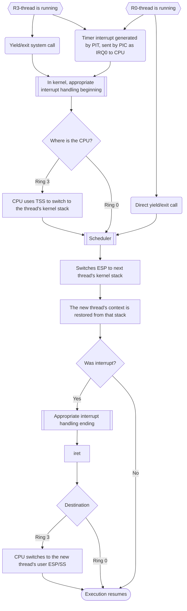

# Rudimentary x86-32 OS
An operating system built to serve as a showcase of simplified orthodox design. It has been tested on an i586 processor emulated via Bochs 2.8.

Note it is heavily Work-In-Progress. This includes both the code and the below text.

For architecturally unimportant details, see the code itself, which is annotated.

The OS has the following features:

| Name                        | Implemented? | Description |
| --------------------------- | - | --- |
| BIOS-booting                 | Y | Given x86 typically uses BIOS, this is only natural. |
| Preemptive Scheduling       | Y | It is interrupt-driven. Context switches are done with Round Robin for simplicity. |
| Multitasking                | Y | Multiple threads and programs residing in memory at once. |
| Demand-paging                | - | Memory is implemented via pages are exchanged. Exchanges use the random policy. |
| Simplified Unix File System | - | Including inodes. |
| Simple Privilege Levels     | Y | . |
| System Call Interface       | Y | We have system calls. |
| Traditional Synchronization | Y | We have all the synchronization primitives. |
| Shared buffers and Mailbox IPC | Y | . |
| PS/2 Keyboard Driver        | . | very simple |
| ATA PIO Disk Driver         | Y | very simple |
| CLI-interface                   | - | . |

And the following attributes:

| Name | Description |
| --- | --- |
| x86-based             | Supports x86 processors only. Note x86 is little endian. |
| General-purpose       | As opposed to a fridge or something. |
| Orthodox              | Don't be bold, follow the mold. |
| Uniprocessor          | That only one task is running at a time. It does not utilize multiple cores. |
| Monolithic            | OS services and resources are in the kernel space. |
| Static Device Drivers | All device drivers are hard-coded into the OS, |
| Process Isolation     | . |

# 1 How to use
In terms of physical hardware, it is today only legacy machines that are capable of running this, which you are unlikely to have lying around. So we heavily recommend emulating the hardware instead.

## 1.1 Hardware Requirements
The CPU needs to be x86 32-bit, obviously

Disk needs to have an ATA interface. Many modern disks lack it, so you probably need an emulation layer.

does not support usb keyboard

## 1.2 Compilation
explain the makefile we provide

Note we compile using GCC. We are using AT&T syntax for assembly which is default for GAS.

Have to compile without thunking so we can control where code is

## 1.3 From Emulator
Instuctions on how to set up Bochs for this

With Bochs, use an image as a disk rather than USB?

We have provided a bochsrc configuration. To use it, it needs to be placed wherever bochs looks for it.

## 1.4 From USB
There is no installer to this OS, and it is very difficult to manually transplant an OS into a machine, so we only detail the much simpler booting from a USB device. This however, has the adverse effect of all disk actions having to inefficiently pass through the USB device

The the image has to be "burned" onto the USB.

You select the USB as the device to boot from in your machine's bootloader.

# 2 Design Overview
| Section |
| --- |
| [3 Startup](#3-startup) |
| [4 Execution Management](#4-execution-management) |
| [5 Volatile Memory Management](#5-volatile-memory-management) |
| [6 Interprocess Communication](#6-interprocess-communication) |
| [7 File System](#7-file-system) |
| [8 Keyboard Driver](#8-keyboard-driver) |
| [9 Screen Driver](#9-screen-driver) |
| [10 Disk Driver](#10-disk-driver) |
| [11 Serial Driver](#11-serial-driver) |
| [12 Libraries](#12-libraries) |
| [13 Sources](#13-sources) |

## 2.1 Folder Structure
```text
boot/
└── bootblock.s

kernel/
├── kernel.c/h
├── kernel.ld
├── entry.S/h
├── faults.S/h
├── interrupt.c/h
├── scheduler.c/h
├── pic.c/h
├── synchronization.c/h
├── memory.c/h
├── paging.c/h
├── mailbox.c/h
├── fs/
│   ├── fs.c/h
│   ├── block.c/h
│   └── inode.c/h
├── kdaemons/
│   ├── loader.c/h
│   └── clock.c/h
└── drivers/
    ├── keyboard.c/h
    ├── disk.c/h
    ├── serial.c/h
    └── screen.c/h

lib/
├── minstd/
│   ├── string.c/h
│   ├── types.c/h
│   └── utils.c/h    
├── syslib.c/h
├── utils.c/h
├── time.c/h
├── sleep.c/h
└── print.c/h

tools/
└── createimage.c/h

user/
├── programs/
│   ├── shell.c/h
│   └── etc.
└── include/
    └── headers/
        └── etc.
```

## 2.2 Disk Layout
(NB: Items are placed in order.)

| Sectors           | Description        |
|-------------------|--------------------|
| 1                 | Bootblock          |
| `KERNEL_SECTORS`    | Kernel             |
| 1                 | Superblock         |
| `INODE_SECTORS`     | Inodes             |
| 1                 | Allocation Bitmaps |
| `DATABLOCK_SECTORS` | Data Blocks        |
| 1                 | Program Directory  |
| 1                 | Shell              |
| Many              | Programs           |

## 2.3 Volatile Memory Layout

| Space | Description |
| ----- | ----------- |
| ?     | Kernel Space |

# 3 Startup
When a CPU using x86 architecture first loads up, it enters its reset state, which is in Real Mode (16bit) with interrupts disabled. It then reads and runs the physical address 0xFFFF0 where the BIOS firmware is. The BIOS then selects a bootable device to jump to.

## 3.1 Image Creation
Both the BIOS and kernel expect the contents of the OS to be structured in a certain way. In mind of that, we make for easy insertion into the booting device the OS shall reside in a disk image, which is an ordered sequence of uncompressed binaries. It is called an "image" because it is an exact image of what the booting device should look like.

Note since image creation is not in an embedded context, we are able to access C/C++ standard libraries.

Since the kernel needs to be loaded into memory during boot, it is important it knows the size of the kernel. This could be done during boot, but we do it at image creation. It is done by counting how many sectors the kernel is, and then writing it into somewhere the bootloader checks.

See [2.2 Disk Layout](##2.2-disk-layout) for the exact layout of the image. 

### 3.1.1 ELF-handling
Since files are expected to be compiled in the ELF format, and so contain ELF Headers. With how rudimentary this OS is, this information is scarcely utilized during runtime. And so it is stripped during image creation and potentially relevant information in it is gleaned and written down elsewhere. This both simplifies finding that information and reduces image size.

ELF File Header:

| Field         | Description                                                                         |
| ------------- | ----------------------------------------------------------------------------------- |
| `e_ident`     | Identification bytes: ELF magic number, class (32/64-bit), endianness, ABI, version. |
| `e_type`      | Object file type (relocatable, executable, shared library, core dump, etc.).         |
| `e_machine`   | Target CPU architecture (e.g., x86, x86-64, ARM, RISC-V).                            |
| `e_version`   | ELF format version.                                                                  |
| `e_entry`     | Virtual address of the program entry point.                                          |
| `e_phoff`     | File offset to the Program Header Table.                                             |
| `e_shoff`     | File offset to the Section Header Table.                                             |
| `e_flags`     | Architecture-specific flags.                                                         |
| `e_ehsize`    | Size of the ELF header itself.                                                       |
| `e_phentsize` | Size of one Program Header entry.                                                    |
| `e_phnum`     | Number of Program Header entries.                                                    |
| `e_shentsize` | Size of one Section Header entry.                                                    |
| `e_shnum`     | Number of Section Header entries.                                                    |
| `e_shstrndx`  | Index of the section containing section names.                                       |

Remarks:
- There can be an arbitrary number of Program Headers as described by `e_phnum`.
- A check needs to be applied on `e_ident` for 32-bit and `e_machine` for x86 architecture.
- Since we are only using the Execution View, we skip Linking View specific things like Section Headers. Execution View is used when it is loaded in memory.

ELF Program Header: Shows us the structure of the ELF header containing metadata and offset to Program Header as Elf32_Ehdr.e_phoff.

| Field      | Description                                               |
| ---------- | --------------------------------------------------------- |
| `p_type`   | Segment type (`PT_LOAD`, `PT_DYNAMIC`, `PT_INTERP`, etc.). |
| `p_flags`  | Access permissions (read, write, execute).                 |
| `p_offset` | Offset of segment data within the file.                    |
| `p_vaddr`  | Virtual address where segment should be loaded.            |
| `p_paddr`  | Physical address.             |
| `p_filesz` | Number of bytes occupied in the file.                      |
| `p_memsz`  | Number of bytes occupied in memory.                        |
| `p_align`  | Required alignment of the segment.                         |

Remarks:
- `p_offset` gives location from beginning of the file.
- `p_type` gives us the type of the segment, we want to load only the ones of type PT_LOAD.
- `p_addr` the location in memory of the segment in memory.
- `p_memsz` number of bytes that needs.
- `p_filesz` number of bytes occupied, can be zero.

TODO: Some unncessary information is not being stripped.

## 3.2 Bootblock
Our bootloader consists only of the first sector bootblock. The boot sector and first instruction of the bootblock need to be located at 0x07C00 in memory, and occupy precisely 512 bytes (1 sector).

1. realmode stack
2. Set segment registers. DS, CS, SS, ES. Needed to reference self and for the long jump? 
3. Load the next stage (in this case, the kernel). It needs to use interrupt 0x13 for this. Note it takes an 8bit integer for sectors to read, meaning it is only able to load 255 sectors at once. For a kernel of greater size, a loop is required, but has yet to be needed. Now our memory should look approximately like this: 

| Address         | Name          | Description                                                                                                    |
|-----------------|---------------|----------------------------------------------------------------------------------------------------------------|
| 0x07C00         | Bootblock     | Located from the CPU reset entry point. |
| 0x07DFE         | Boot signature | 0x55AA                                                                                                          |
| 0x08000         | Kernel        | Several sectors.                                                               |
| 0x70000-0x7FFFE | Stack         | Top of stack at 0x7FFFE. Grows downward to lower addresses.                                      |

4. Enable the A20 line to allow addressing beyond the first megabyte. The fast A20 method is used without fallback. Some legacy machines do not support this.
5. Switch to Protected Mode (to enter 32-bit). Disable interrupts to avoid jumping to garbage once Protected Mode has been entered, in case hardware still has the old interrupts. Create a GDT (Global Descriptor Table). We need three GDT Entries. The first is the Null Entry with everything zeroed out. The second and third are the Code Entry and Data Entry fo ring 0, since that is the level we start at. They share limit and base since they need to start and access the same places. The location of these are then written into the CPU's GDT register using the LGDT instruction.

GDT Entry:

| Bits  | Field        | Description                                | Value to set | Reason |
| ----- | ------------ | ------------------------------------------ | ------------ | ------ |
| 0-15  | Limit[15:0]  | Lower 16 bits of segment limit (of where kernel can be addressed). | 0xFFFF | No reason kernel should not be able to access everything during startup. Lower part of 4-GB limit. |
| 16-31 | Base[15:0]   | Lower 16 bits of base address.             | 0 | Base address is 0 since image of the disk starts at 0. |
| 32-39 | Base[23:16]  | Middle 8 bits of base address.             | 0 | Base address continued. |
| 40    | Type[0]      | Accessed.                                  | 0 | Managed by the CPU. |
| 41    | Type[1]      | Readable (code) / Writable (data).         | 1 | Needs to be usable. |
| 42    | Type[2]      | Conforming (code) / Expand-down (data).    | 0 | ? |
| 43    | Type[3]      | Executable (code) / Reserved (data).       | 1 (code) / 0 (data) | Only used to indicate it is code. |
| 44    | S            | Descriptor Type.                           | 1 | 0=System, 1=Code/Data |
| 46-45 | DPL          | Descriptor Privilege Level (0–3).          | 0 | Ring 0 (kernel). |
| 47    | P            | Present.                                   | 1 | Always 1. |
| 48-51 | Limit[19:16] | Upper 4 bits of segment limit.             | 0xF | Completes the limit. |
| 52    | AVL          | Available for software use.                | 0 | Unused. |
| 53    | L            | 64-bit code segment.                       | 0 | 0=16/32bit, 1=64bit |
| 54    | D/B          | Default operand size.                      | 1 | 0=16bit, 1=32bit |
| 55    | G            | Granularity.                               | 1 | Multiplier of limit, need to reach 4-GB (0=byte, 1=4KiB). |
| 56-63 | Base[31:24]  | Upper 8 bits of base address.              | 0 | Base address continued. |

6. Set CR0's (Control Register's) bit to enable Protected Mode.

CR0 bits:

| Bit | Name                       | Meaning                                  |
| --- | -------------------------- | ---------------------------------------- |
| 0   | **PE** (Protection Enable) | Enables Protected Mode.                  |
| ... | ...                        | (Irrelevant for our purposes, set to 0.) |
| 31  | **PG** (Paging)            | Enables paging.                          |

7. Long jump to next stage. Not simply a normal jump, because this flushes Real Mode remnants and loads code segment (?). The destination of the jump needs to be the entrypoint of the kernel. The location of which is not reliably controllable in C. This is solved here by writing it down into the ELF-header via the linker script, which is then written into the bootblock during image creation.
8. For the device to be identified as bootable, the first sector needs to end with signature 0x55AA. 

## 3.3 Kernel Initialization
This consists of initializing all the parts of the kernel, each of which is shown later.

# 4 Execution Management
A general-purpose OS is characterized by its ability to run arbitrary user programs. A program is a series of code (instructions) and data. Since you should be able to run multiple programs, and since a program should be able to run multiple tasks, yet the CPU is only able to process one task at a time, a first question is in what order they should be run in. The orthodox answer is to run them in small timeslices in round-robin rotation for various (but no particularly strong) reasons.

One aspect of this that is not arbitrary however, is preemption, the ability to interrupt a task at an arbitrary time. When that is not possible, tasks either run until completion, or yield at times specified in their programs. This is unacceptable for isolation as it may stop the entire OS if programs fail to do so, which is why the scheduled preemption in a typical round-robin rotation is important. And furthermore, a lack is also not compatible with modern hardware, where most devices use arbitrary interruptions regularly, something execution is expected to be able to recover from.

When yielding at specific times or only on completion, it is possible no context needs to be saved between each resumption, and when context needs to be saved, it could be specified by the programs. However, there are no such guarantees on arbitrary interruptions. In mind of which, on each preemption, context is saved. Theoretically a task could do something like politely toggling a switch on whether it is doing a task that needs context to be saved on interruption, but given how the answer almost always is yes, it is better to save the context regardless. Each line of execution context, through both the CPU and while saved, is called a thread.

When a program is run, it gets launched as a single thread that begins executing the instructions in it. These instructions are then capable of occupying resources like by obtaining entries in the kernel or launching more threads. And when the thread exits, all resources occupied by it need to be freed (since they are limited). This is not reliably done by leaving it up to the thread, since there is no guarantee the program it is running is written right. In the orthodoxy, a model of downstream hierarchical culpability is used, where terminating a thing also recursively terminates and frees everything that it has spawned or occupied. To allow that, ownership generally has to be unambiguous and untransferable.

This hierarchy is in the orthodoxy organized around specific owner objects, processes (an undescriptive name), where a process is able to own arbitrarily many processes and that when threads obtain ownerships, they are granted to the processes which own the threads. There is no strict reason for using processes, but it is clean. Worth considering, is also the idea that the kernel itself is a resource environment much like a process, capable of owning say its own threads (known as kernel daemons, working as background services). And note a program naturally has to be launched with a starting process.

## 4.1 Processes
Processes are allocated in a fixed size pool of control blocks for simplicity.

Process Control Block:

| Field           | Purpose                                      |
| --------------- | -------------------------------------------- |
| `pid`           | Unique process identifier.                   |
| `state`         | READY, RUNNING, EXITED, BLOCKED.             |
| `next`          | Next PCB.                                    |
| `prev`          | Previous PCB.                                |
| `parent`        | . |
| `threads`       | Owned threads.                               |
| `processes`     | Owned processes. |

Interface:

| Name | Description |
| --- | --- |
| `pid_t process_create()` | Allocate a new PCB, address space, pid, and create a first thread for it. Uses the memory manager to get its address space and sets up a heap in it and a stack for the first thread. |
| `void process_exit(int)` | Terminates the process of the thread's environment. Uses an int to take status. |
| `int exec(char*, char*[], char*[])` | Replaces process image with a program. Makes a stack for it too. Takes a path to replace at, arguments, and an image. Strangely, this is separate from process creation in UNIX due to an old technicality. |
| `pid_t get_pid()` | Returns pid of current process. |

## 4.2 Threads
Threads are also allocated in a fixed size pool of blocks for simplicity.

Thread Control Block:

| Field            | Purpose                                                           |
| ---------------- | ----------------------------------------------------------------- |
| `tid`            | Unique thread identifier.                                         |
| `state`          | Current thread state (Ready, Running, Blocked, Terminated, etc.). |
| `kernel_stack`   | Addresses of the thread's kernel-mode stack. For context switches, there is easily an arbitrary amount of information to restore, the TCB, being a fixed size, is unable to contain all necessary information itself, and needs a stack. |
| `user_stack`     | Addresses of the thread's user-mode stack (if applicable). For resumption of usermode execution.     |

Interface:

| Name | Description |
| --- | --- |
| `tid_t thread_create(void*, char*)` | Allocate a new TCB, allocate stack, add dummy register data, add to scheduler queues. |
| `void thread_exit(int)` | Terminate the calling thread. |
| `void thread_yield()` | Give up CPU. |
| `tid_t get_tid()` | Returns tid of current thread. | 

### 4.2.1 Initialization
Make a dummy thread (a trampoline), and then have it use the exit routine.

That consists of making dummy blocks and a dummy usermode context on its kernel stack that needs to be iret'ed from to begin the process in usermode. Then, the process yields to the next process.

both user and kernel threads likewise in general need dummy context when first created

We need to set its EFLAGS:

Non-reserved EFLAG bits:

| Bit   | Name | Description                          | Value to set |
| ----  | ---- | ------------------------------------ | ------------ |
|     0 | CF   | Carry Flag                           | |
|     2 | PF   | Parity Flag                          | |
|     4 | AF   | Auxiliary Carry                      | |
|     6 | ZF   | Zero Flag                            | |
|     7 | SF   | Sign Flag                            | |
|     8 | TF   | Trap Flag (single-step debugging)    | |
|     9 | IF   | Interrupt Enable Flag                | |
|    10 | DF   | Direction Flag (string instructions) | |
|    11 | OF   | Overflow Flag                        | |
| 12-13 | IOPL | I/O Privilege Level                  | |
|    14 | NT   | Nested Task                          | |
|    16 | RF   | Resume Flag                          | |
|    17 | VM   | Virtual-8086 Mode                    | |
|    18 | AC   | Alignment Check                      | |
|    19 | VIF  | Virtual Interrupt Flag               | |
|    20 | VIP  | Virtual Interrupt Pending            | |
|    21 | ID   | CPUID available                      | |

EFLAGS start the same for r0 and r3 threads

## 4.3 Execution Context
In monolithic kernels, this is in ensuring user level stuff does not hurt kernel level stuff. Although some have argued this is bad, and that the kernel should also be protected from drivers. But we have too few drivers to care.

### 4.3.1 Privilege Levels
It is useful to have a distinction between different privilege levels for protection purposes. There are many important features built into the CPU that occur upon changing privilege levels. Most important one is using the kernel stack set in TSS, at esp0 for when ring 0 needs to be entered.

hardware is built to support it, so there is no reason to make a custom implementation. However, the way GDT supports protecting resources is obsolete in the orthodoxy, so setting up the GDT consists of not using it. Specifically memory access per privilege is handled by paging.

Only two levels of privileges are orthodox ring 0 (kernel mode) and ring 3 (user mode). The others are considered vestigial.

To switch between them the following needs to be set up:

GDT describing each privilege level and TSS.
Null entry
Kernel code
Kernel data
User code
User data
TSS

GDT Entries:

| Bits  | Field        | Description                                | Value to set  | Reason |
| ----- | ------------ | ------------------------------------------ | ------------- | ------ |
| 0-15  | Limit[15:0]  | Lower 16 bits of segment limit             | 0xFFFF        | Maxed out for user entries too, because management by GDT is incompatible with paging. So yes, this aspect is obsolete in the orthodoxy. |
| 16-31 | Base[15:0]   | Lower 16 bits of base address.             | 0             | ... |
| 32-39 | Base[23:16]  | Middle 8 bits of base address.             | 0             | ... |
| 40    | Type[0]      | Accessed.                                  | 0             | ... |
| 41    | Type[1]      | Readable (code) / Writable (data).         | 1             | ? |
| 42    | Type[2]      | Conforming (code) / Expand-down (data).    | 0             | ? |
| 43    | Type[3]      | Executable (code) / Reserved (data).       | 0 (D) / 1 (C) | ? |
| 44    | S            | Descriptor Type.                           | 1             | ... |
| 46–45 | DPL          | Descriptor Privilege Level (0–3).          | 0 (K) / 3 (U) | 0 = Ring 0, 3 = Ring 3 |
| 47    | P            | Present.                                   | 1             | ... |
| 48–51 | Limit[19:16] | Upper 4 bits of segment limit.             | 0xF           | ... |
| 52    | AVL          | Available for software use.                | 0             | ... |
| 53    | L            | 64bit code segment.                        | 0             | ... |
| 54    | D/B          | Default operand size.                      | 1             | ... |
| 55    | G            | Granularity.                               | 1             | ... |
| 56-63 | Base[31:24]  | Upper 8 bits of base address.              | 0             | ... |

NB: "..." means the reason is the same as in the previous GDT used during boot.

TSS differs significantly, and the differences are as follows:

| Bits  | Name    | Value | Reason                                       |
| ----- | ------- | ----- | -------------------------------------------- |
| 41    | Type[1] | 0     | ?                                            |
| 42    | Type[2] | 0     | ?                                            |
| 43    | Type[3] | 1     | ?                                            |
| 44    | S       | 0     | TSS entries are controlled by the processor. |
| 46-45 | DPL     | 00    | Only used by kernel.                         |
| 54    | D/B     | 0     | Uses 16 bit.                                 |
| 55    | G       | 0     | Uses small size.                             |

Its base and limit are also based on something else.

Privilege changing requires interrupt and iret

### 4.3.2 Capabilities
It is useful to have restrictions on what user execution is allowed to do at any given moment. This is naturally saved alongside execution context in threads. The orthodox way of managing this is complicated, and so we prefer a system where almost every user permission is a thread capability. For the result that objects which should be differentially accessible by user processes are managed by capabilities.

We give the following capabilities in the byte:

| Name | Description |
| --- | --- |
| access | Allowed to use the thing. Generally always set to 1. |
| admin | Mote destroy and in-place modify the capability. |
| revoke | Mote revoke access to the capability. Even from itself and others with revoke rights. Non-admins mote not revoke admins. |
| copy_reference | Mote pass infinitely many pointer capabilities to itself. |
| copy_new | Mote make new capabilities with as many rights as it has. |

Upon first making a capability for a thread, all fields are set to true. Capabilities have a use counter that has them deleted when at 0?

Capability bounds are enforced in two ways. #1 The kernel owns the object and checks the capability of the current running thread when the object is accessed or the capability is used. #2 The object is in protected memory in the userspace (read and/or write access disabled), and accessing the area goes through the kernel, requiring a capability check.

There are many ways to store capabilities. The orthodoxy uses a global slab allocator. But for now, we do the very bad way of giving each TCB a small capabilities buffer.

## 4.4 Interrupts
Interrupts can be classified into three categories: #1 Hardware interrupts are generated by hardware independent of what is being run in the OS. The most important to configure, the IRQs, go through the PIC (Programmable Interrupt Controller) and then to the CPU. #2 Software interrupts are called from software in the OS using the interrupt instruction INT. #3 CPU exceptions are generated by the CPU upon encountering specific situations. All three then get directed to their IDT entries in the CPU which is used to jump to the respective handlers. The CPU disables interrupts upon doing so and enters ring 0.

All interrupts run at kernel level, the interrupt handler changes privilege level.

### 4.4.1 IDT
Each interrupt needs to be mapped to an IDT Entry.

IDT Entry:

| Bits  | Field    | Description                         | Value to set                         |
| ----- | -------- | ----------------------------------- | ------------------------------------ |
| 0-15  | Offset   | Lower bytes of the address.         | Address to handler off the selector. |
| 16-31 | Selector | Code segment selector.              | Kernel code segment.                 |
| 32-39 | Reserved | Needs to be 0.                      | 0                                    |
| 40-43 | Type     | 14 = interrupt gate, 15 = trap gate | 14                                   |
| 44    | Storage  | 0 for gates                         | 0                                    |
| 45-46 | DPL      | Ring that can call this with INT.   | 0 or 3                               |
| 47    | Present  | That the interrupt is usable.       | 1                                    |
| 48-63 | Offset   | Higher bytes of the address.        | Address continued.                   |

Notes:
- Type bits are the same across entries since they are all interrupt gates.
- In choosing between interrupt and trap gate, we use interrupt gates for all entries because it is simpler.
- Entries differ by DPL since not all interrupts are on each privilege level. And differ by handler address.
- A few interrupts do not need an IDT entry, but they do not need to be configured in any way, so they are ignored here.

IRQs start disabled, so they need to be enabled by unmasking their bits in their PICs.

### 4.4.2 PIC
Needs to be configured for IRQs

### 4.4.3 Interrupt List
There are 256 possible IDT entries, one for each interrupt number. Only a few of them are needed in this OS, and so only those are configured. CPU exceptions are from indexes 0-31, while Software interrupts and hardware IRQs can be assigned indexes freely, but we follow typical conventions for them. There are two PICS, the Master (IRQ0–IRQ7) and Slave (IRQ8–IRQ15), and they occupy the indexes 32-47 here.

List of configured interrupts:

| Number | Name | Category | Notes |
| ----- | ---- | --- | --- |
| 0 | Divide Error | Exception | |
| 6 | Invalid Opcode | Exception | |
| 8 | Double Fault | Exception | |
| 13 | General Protection Fault | Exception | |
| 14 | Page Fault | Exception | |
| 32 | Timer | Hardware | IRQ0. For preemptive scheduling. |
| 33 | Keyboard | Hardware | IRQ1. |
| 128 | System Call | Software | |

Notes:
- Exceptions and Hardware Interrupts use DPL 0. Software Interrupts use DPL 3. This governs from which ring the interrupt is arbitrarily callable.

### 4.4.4 System Calls
It is useful to have an interface for important kernel functions that can be accessed from any privilege level. This could be done by giving each function you want accessible its own software interrupt, but that quickly fills all IDT Entries as your OS expands. This is why the canonical approach uses a dispatch to the OS instead. It has one "system call" software interrupt which takes register values as arguments with one as the identifier of which system call is being requested. Interestingly, because this eats up all non-niche potential software interrupts, it leaves most IDT Entries unused.

To make using system calls more convenient, we have a file named "syslib" which provides wrappers for all system calls. It is also the only complete list of system calls we have.

## 4.5 Scheduling
Round-robin, like many forms of scheduling, works on a circular linked list of threads, the ready queue. Naturally, it is implemented like any circular linked list, but it uses TCBs as nodes. To divide these timeslices, there needs to be a timer to decide when a thread has run for long enough. The only reliable timer in hardware is generated as IRQ0, the timer interrupt, configurable by the PIT. Usually it has a default, and we do not have any time-critical operations yet, so we do not configure it. Finally, when a thread is to be switched, it performs what is called an execution context switch.

In addition to interruptions, a thread should be able to exit and yield at arbitrary times, since there is no reason for a thread to hog the CPU when it has nothing more to do.

### 4.5.1 Execution Context Switch
An interesting fact is that the TSS (Task State Segment) is a part of hardware that was intended to be used for keeping track of the execution context (the task state) and to be used for switching context around. However, due to the inflexibility of everything being changed between each switch, despite many parts possibly being shared between each thread (like in our thread-process model), it quickly becomes unnecessarily expensive, and is considered mostly obsolete in the orthodoxy. And so that is managed by software instead, and the TSS remains mostly unused.

After the timer interrupt is called and the interrupt handled like normal, for a software-based context switch, the scheduler in kernel is entered. There, it saves the context and selects the next thread and purges the incumbent thread if needed. The context of the new thread is then restored by restoring the CPU context and setting esp0 of the TSS to the kernel stack so it can use it in case of interrupts (in 64-bit more parts of the TSS get set).

Yield/exit calls directly from the kernel need special handling, since they do not pass through typical interrupt mechanisms, yet also potentially need to toggle interrupts. So direct calls need a wrapper that disables interrupts and pops an iret frame with appropriate flags at the end to reenable them.

Flow chart:



### 4.5.2 Initialization
Scheduling is not trivial to initialize, since you usually "pick up from" previous execution contexts.

the initial trampoline thread gets its context pushed onto the startup stack, which is fine, because that stack is going to be discarded anyway

### 4.5.3 Blocking
blocking a thread consists of taking it out from the ready queue and moving it to a waiting queue. This ends badly if the thread that is responsible for unblocking the other thread never does so, which is why it needs to be done carefully

## 4.6 Synchronization
the use of busy waits isn't great

Critical Sections, interrupt disabling

## 4.6.1 Critical Sections
Since it is possible for interrupts to happen at any time, it can lead to race conditions on shared resources. That is why there are critical sections, which are parts of code where interrupts are disabled.
enter_critical
leave_critical
leave_critical_delayed

### 4.6.2 Synchronization Primitives
Standard ones you are probably well familiar with and don't need to be explained.

should these be merged with IPC somehow?

how to support user-level use?

Mutex
lock_init(lock_t)
lock_acquire(lock_t)
lock_release(lock_t)

Semaphores
semaphore_init(semaphore_t)
semaphore_up(semaphore_t)
semaphore_down(semaphore_t)

Condition Variables
condition_init(condition_t)
condition_wait(lock_t, condition_t)
condition_signal(condition_t)
condition_broadcast(condition_t)

Barriers
barrier_init(barrier_t)
barrier_wait(barrier_t)

# 5 Volatile Memory Management
An OS wants some information to be able to persist in some form readily accessible for the processor.

That has already been done in loading the kernel code/data for instance, residing in one part of the RAM, which owing to how it is only used internally, with all other uses specially configured, it can be treated like a static block, a distinct area of managed memory, because it is not managed. Likewise, there are potentially some hardware-reserved regions, but they do not need to be interacted with by the OS, and so are also not managed. Both these cases do not require elaborate memory management.

The remaining area is used for dynamic allocations by the kernel and allocations of and by user processes. The latter owing to us following a conventional process model. This is the managed area of memory.

## 5.1 Address Space Management
When tasks use memory, there should be a way for them not to collide with each other's regions, and also avoid extending into unintended areas like the kernel. Leaving that to each task to self-regulate is unacceptable when tasks are supposed to never interfere with each other, which crosses out local protocols in favor of centralized management. And so it is conceived of that each process is allocated address space(s), and that there is a registry keeping track of permissions and so on for these spaces or parts of them.

That alone is sufficient, but not complete in terms of capturing boilerplate. Processes need to keep track of what parts of memory they manage, which is complicated when allocated space is not reliably contiguous, or alternatively parts of memory are not allowed to be divided, and large caves are left unfilled. Also that moving address chunks around would require complicated signaling.

The solution to that is per-process virtual memory. Virtual memory is a mapping of virtual addresses to eventual physical ones, allowing a structure to be represented contiguously in virtual memory despite no corresponding or fragmented physical presence. It is "per process" since though a single pool allows easy movement and incontiguity of physical parts, it has far greater fragmentation risk, owing to the lesser flexibility and the sheer amount of addresses being fewer.

Yet, there remains much fragmentation risk. Virtual addresses are not easily relocable because there is no in-built mechanism for managing all pointers in case of movements. That inevitably hinders large contiguous allocations, usually so during long sessions, and there is no perfect solution for it. There are known measures which can be taken to reduce the likelihood of especially bad fragmentation patterns, but not are not much taken here. Note part of the motivation for why 32-bit was largely superceded by 64-bit was to increase the address space as to make the especially bad fragmentation patterns less likely.

A next complication is that we are also following a model of separate ring 0 and ring 3 privilege levels, raising the question of whether in per-process the content for the two levels should be in separate virtual spaces. The orthodox answer to this is no, splitting the dynamic space in two, one part for the kernel only, present in every process. The advantage is to avoid invalidating the TLB each time privileges switch by referencing what is already there, as opposed to having to reload it every time. With the disadvantage of reducing the amount of potential addresses for both kernel and processes, increasing fragmentation risks.

There is an internal functions for allocating user address space. And the kernel exposes a system call for allocating and deallocating user space memory each.

// missing more discussion on TLB

## 5.2 Swapping
A side-effect of virtual memory is that the virtual address space could be extended to use disk space as further memory. Which has to be managed such that data in disk but not in memory needs to be loaded into memory, swapping something back into disk in exchange (unless it is no longer needed).

Swapping generally slows performance somewhat. The greatest non-I/O cost of swapping is perhaps in handling missing data (page faults), in that they also are interrupts (with all their associated overhead).

And it is also noteworthy disk operations are magnitudes slower than volatile memory ones, which slows down. That can lead to thrashing, which is when most execution resources are spent on moving data in and out of memory because useful data is constantly being swapped in and out due to lacking RAM. Meaning the primary use-case for swapping is for rarely used data.

Swapping is also usable as emergency persistent storage, but that is not ever used here.

## 5.3 Undetermined Use
Another query one may raise about memory use in general is how "undetermined use" is managed (note it is not a standard term). It refers to how it sometimes is impossible to predict how much memory a task is going to consume. In contrast to predetermined use, where you can cleanly allocate a slot of fixed size somewhere to cover the use without wasting space and without having to expand it later.

The naive solution to undetermined use, the "better safe than sorry approach" of generously endowing each instance of undetermined use, quickly becomes a massive waste of space, and a demand-based approach is necessary for any serious management. For that, a typical approach involves memory structures capable of reserving space without physically occupying it, lazy-allocation. That is done by committing virtual addresses for something without committing corresponding physical ones.

The typical way of organizing that for each dynamic space is by a pool shared among many heaps (or only one for kernel). When one of these heaps wants to allocate, it walks its holding of blocks of its virtual space to find a contiguous space, splits the block upon selection, and then it requests memory for that from the pool, conceptually. This is further granulizable by lazy-allocating with the heap allocations, such that no memory is committed until actually written. In our case, either of #1 pools, allocated like that by `malloc`, whereas `calloc` does write it. And #2 stacks, not committing memory until the stack pointer reaches the frontier. Stacks are only created for threads, done so upon initializing them. There are not any clear weaknesses of this system, so there is no reason not to use it.

In UNIX there are more contours, say with a distinct main stack capable of resizing, but none of that is implemented here.

## 5.4 Paging
And as for implementations of virtual memory, the most relevant one is paging. Hardware also supports segmentation, but standard setups consist of obsoleting it like is done here. Heterodox implementations are rarely worth it due to lacking hardware support involving much more overhead.

Given there is swapping, this is demand-paging specifically

Reserving memory consists of allocating virtual addresses. And allocating physical memory consists of then using the reserved memory, triggering a page-fault.

decides how the physical memory pool is managed via a page replacement algorithm

a thread can request a mapping? for use with shared memory. check if has already been mapped earlier before adding it. how does the process know when to free it though?

### 5.4.1 Two-level Entry Structures 
Functionalities of the bits in both entries:

| Bit     | Code     | Description                                                                                         |
|---------|----------|-----------------------------------------------------------------------------------------------------|
| 0       | P        | Present: Whether page is in physical memory. Used for page faults.                                  |
| 1       | R/W      | Read/Write: 1 = Read/Write, 0 = Read Only.                                                          |
| 2       | U/S      | User/Supervisor: Privilege level to access. 1 = user level, 0 = supervisor only. Important for PTs. |
| 3       | PWT      | Write-Through: Enables write-through caching.                                                       |
| 4       | PCD      | Cache Disable: Disables caching.                                                                    |
| 5       | A        | Accessed: Whether a PTE was read during a virtual address translation.                              |
| 6       | AVL / D  | (PD) Empty. (PT) Dirty: Whether the page was written on after being loaded.                         |
| 7       | PS / PAT | (PD) Page Size: PT is 4KB or a 4 MB. (PT) Page Attribute Table.                                     |
| 8       | AVL / G  | (PD) Empty. (PT) Global.                                                                            |
| 9 - 11  | AVL      | Empty.                                                                                              |
| 12 - 31 | ptr      | Address of (PD) Page Table or (PT) Page Frame in physical memory.                                   |

### 5.4.2 Page Faults 
exposes page_fault_handler for the interrupt

### 5.4.3 Allocating Pages

### 5.4.4 Swapping Pages

### 5.4.5 Initialization

## 5.5 Object Residency
Objects may be created in different parts of memory. For use with synchronization and IPC objects.

Distinctions of: #1 kernel-level, inaccessible to user processes. #2 protected user-level, userspace stuff with write and sometimes also read access restricted, needing to go through system calls to the kernel for access. #3 unprotected user-level, which has no more pertinent kernel-level checks after being established.

# 6 Interprocess Communication
Say a process wants to pass information to another. For that, the first half is the recipient reading the information, which has to either be written inside or outside its memory space, only possibly constituting addresses within a process' userspace and the global kernel space respectively, owing to our implementation of virtual memory only leaving those parts potentially accessible to a process. Mutatis mutandis the sender. These are forms of shared physical memory mappings, that different (or the same, in the case of the kernel) virtual addresses map to the same physical addresses. (Mapping handled by paging. And it keeps it consistent in case of rotations and stuff.)

It would seem a lot simpler to only use shared kernel memory for IPC, since it is already mapped the same way for every process. However, this is not depended on in orthodox design for a few reasons. Firstly, kernel address space is limited and so more prone to fragmentation problems, as outlined earlier. Secondly, accessing kernel memory requires a system call, which is more expensive than not making one. For applying both, there are unprotected user-level objects, fully discrete for their processes (and so you have to trust they do not get corrupted by them). Only that the kernel allocates something like a shared buffer for them. And for applying only less fragmentation, there are protected user-level objects.

## 6.1 Rendezvous
To enforce isolation, both in that processes are not to disrupt each other, and not to say read information from others arbitrarily, it is apparent all processes by default should not be able to access each other's IPC objects. This means neither simply having say a global list of handles open to all processes, nor having randomly generated guessable handles, are acceptable. This means processes have to discover each other to only authorize the other for IPC access, the Rendezvous Problem. This is difficult, because any other process could theoretically mimic content the other is using to identify.

The only theoretically safe solution to this is using origin, since that is the only state which is always knowable by the originator. This is firstly in kernel threads and processes launched by them. These may be meaningfully registered by the kernel into a kind of PID mapping for identification. And secondly, the processes launched by processes more generally. Since they are able to keep track of each other by say storing their relations as metadata.

Waiting for passwords is also possible, although not strictly safe, as infinitely many processes could indefinitely block the intended process by guessing like a typical DDoS-attack, or the password be guessed right by the wrong process. However, it is still used in the orthodoxy, as there is otherwise no way for two unrelated processes to rendezvous. Rendezvous this way is mediated by the kernel through a small IPC object like a UNIX pipe or socket where they share their password.

## 6.2 Authentication
Authenticating an IPC attempt inevitably has to go through the kernel, as say the handle for an IPC object has to be something like a number, and the number could theoretically be used if guessed otherwise. Our authentication is simple and uses the capabilities system for IPC objects, where processes pass the handle of an IPC object alongside setting a capability to allow its use by the other thread. While for shared memory, that is simply handled by the paging system.

In models where two arbitrary processes are not allowed to IPC, then handles would not strictly need to be authenticated, and authentication could instead be through checking if an operation is legal within what processes are allowed to IPC.

## 6.3 Atomicity
IPC objects have to ensure atomicity. Make use of synchronization stuff and atomic CPU operations for that

## 6.4 Shared Buffers
Technically all buffers are shared buffers, but the only implementation we have is unprotected user-level shared buffers.

Shared memory contiguous in virtual space. Is only usefully distinct as a user-level IPC object. 

Multiple processes mapping the same physical memory as a buffer share the buffer.

Interface:

sbuffer_open: creates if not created

sbuffer_close

## 6.5 Mailboxes
aka. message queue

Can be implemented on top of a shared buffer at any level technically

Unlike shared buffers, mailboxes are based on consumption.

It features two unnecessary copies.

A thread using a mailbox uses receive to grab a message in the mailbox or waits until one is sent if there is none. And uses send to put a message in the mailbox. These are managed with condition synchronization. Messages are variable length and multiple can be present in a mailbox at once.

Interface:

mbox_open: creates if not created

mbox_close: if the owner closes, it has big problems

mbox_send 

mbox_recv 

mbox_stat 

## 6.6 Dispatchers
A thing that sends to multiple mailboxes. It is very simple since it simply does that.

Interface:

# 7 File System
Arbitrary storage is an essential part of general-purpose OS, and the disk is utilized for that by writing data into it, in our case, into the Datablocks sectors. However, for that to be of any use, the data should not be written where there already is data, and it should be retrievable in a predictable manner. Or else, your data is constantly going to be overwritten, corrupted, and require scanning the entire storage space to find. In mind of that, a system is required, a file system.

There are many types of file systems, but for ours, we have based it on the UNIX File System (UFS), although in a greatly simplified form. It exposes the typical user interface of directories with arbitrarily many directories and files inside of them, all of which have names and other metadata. They take on the structure of a tree from the root directory.

It begins when the kernel calls fs_init during initialization.

essential for having user programs

## .2 Disk Interface
Disk as hardware usually divides its storage into sectors, and UFS builds on this by abstracting sectors as blocks. This gets complicated when the possiblities for the hardware are diverse, but since we are only using the disk image, this becomes simple.

### .2.1 Block Read/Write
When read

We also have partial read/write functions.

## .1 Inodes
Central to UFS is representing both directories and files as inodes (index-nodes). They are called this because they are small and contain information to index into the disk blocks for the content of their directory or file. On full UFS, these references to disk blocks can lead to further disk blocks for big files. But in rudimentary system, references are always directly to contents.

### .1.1 Directories
Whereas file contents are arbitrary, directory contents consist of dirents (directory entries). A dirent maps a name to an inode, as represented below. 

dirent:

| Name | Representation | Description |
| --- | --- | --- |
| inum | inum_t | Which inode this name refers to. |
| name | string | Name of a file or folder, max length 13, unused slots filled with 0 bytes. |

### .1.2 Inode Allocation
A new inode is allocated every time a file/directory is created. To easily reference inodes, we assign each inode a unique number. These numbers are managed on a bitmap which is formed with a fixed size when the file system is created, meaning the pool of inodes is limited, and may potentially be exhausted. For this, we have the function get_free_ibmap_entry, which should be the only interface for allocating inodes. It marks the inode bitmap and returns the error of inode exhaustion when it is full.

### .1.3 Inodes on Disk
Since the amount of possible inodes is high, it is undesirable to keep them all in working memory at all times. Therefore, when not needed for activities, inodes are stored on the inode region of the disk with the below representation. That is the only information that needs to persist outside of working memory. 

Note it does not contain the name of the file/directory, since that is not ever necessary to use for any function. For when the name is to be retrieved, it is retrievable from the dirents pointing to its inode.

disk_inode:

| Name | Representation | Description |
| --- | --- | --- | 
| type | category | Whether this is a directory or file. Since you should not be allowed to use say directory operations on non-directory files. |
| size | bytes | Needed for read/write limits. For files, the size in bytes. And directories, number of dirent bytes written. |
| nlinks | numeric | Needed for file/folder removal. Number of dirents pointing to this inode. |
| direct | blkno_t | Numbers of the blocks holding the content, max 8 in our file system. Starts empty. |

### .1.4 Inodes in Working Memory

They use the inode table. It is initialized in fs_init.

icinode: ("in-core inode")

| Name | Representation | Description |
| --- | --- | --- | 
| disk_inode | disk_inode_t | Copy of the corresponding disk inode. |
| open_count | numeric | Number of file descriptors currently referencing this file. |
| pos | numeric | Current read/write byte offset. |
| inum | inum_t | Which slot in the inode bitmap this belongs with. |
| dirty | boolean | Whether the disk inode copy differs from the one actually on the disk. |

There is limited space in the table, so we need to swap out inodes when it is full. A random eviction policy is used for this.

## .3 Persistence
When the OS shuts down, everything in working memory becomes unretrievable. In mind of that, parts of the disk are dedicated to storing information that needs to persist between sessions. We divide these parts into blocks.

The disk has to be formatted with fs_mkfs to have these blocks. It should be called once for each disk. (Granted we only support having a single disk.)

Certain information should be written to disk routinely, in case of unexpected shutdowns, as to avoid inconsistent states.

### .3.1 Datablocks
Filedata is stored in the datablocks.

### .3.2 Allocation Bitmap Blocks
The allocation bitmaps are stored on the block for bitmaps on disk. We have functions bmap_load and bmap_save for this.

### .3.3 Superblock
Each superblock holds all the information of a file system. Even though it is only possible to have one file system, we still leave this design in for cleaner separation of concerns. Note the allocation bitmaps are put under the in-memory superblock structure despite not belonging to it on disk.

disk_superblock: Stored at disk location os_size +2, describes filesystems’s layout 
struct disk_superblock {  
    short ninodes;
    short ndata_blks;
    blknum_t root_inode;
    short max_filesize;
};

icsuperblock: "In-core superblock". Initialized with a copy of the superblock on disk. 
struct icsuperblock {  
    struct disk_superblock d_sb;
    void ibmap; // pointer to inode_bmap[]
    void dbmap; // pointer to inode_bmap[]
    char dirty;
};

### .3.4 Write-back
everything marked as dirty

cleared

A crash loses everything in working memory, which risks losing data and leaving the file system on disk in an inconsistent state when resumed. Since this file system does not have journalling, it needs to rely on other options to keep consistent.

If it crashes while it has written to disk bitmaps and dirent, but not the inode referenced

It is better to order them back inodes first and at the same time, and then bitmaps, because it is possible to determine an inode is supposed to be marked as allocated in the bitmap when you have entries pointing to it, since it could only mean one thing. But when the bitmap is marked as allocated, and the inode is missing in the block, it is often impossible to determine what was intended to be in that inode, since the content is not trivial.

And better to batch them, as it allows you to control the order and makes it less likely the crash occurs while these critical parts are being written

at the end of every fs system call, because at the start of a call the fs is assumed to be in a consistent state

### .3.5 FSCK
To do the repair service we need to walk all bitmaps and entries for inconsistencies.

Report irrecoverable inconsistencies

## .3 Pathname Resolution
When using ".", it resolves to the CWD (Current Working Directory). Else, it resolves to root directory.

When using "..", it resolves to the previous directory.

Can take arbitrarily many '/'

## .4 System Calls
We want to expose a few functions as system calls for the OS. They are as follows:

| Name | Description |
| --- | --- |
| fs_open | Opens a file with flags. There is a flag to create the file if not present. |
| fs_close | Closes an opened file. |
| fs_read | Reads bytes from a file. |
| fs_write | Writes bytes to a file. |
| fs_lseek | Moves the cursor. |
| fs_mkdir | Makes a directory in CWD. |
| fs_rmdir | Removes a directory in CWD. |
| fs_chdir | Changes CWD. |
| fs_link | Creates a link to a file. |
| fs_unlink | Removes a link to a file. Also removes the file if there are no more links to it. |
| fs_stat | Returns file status. |

Note that creating and removing files and directories have separate functions for each type in UFS.

### .4.1 Creation
All directories are initialized with the dirents ".." (parent directory) and "." (current directory).

### .4.2 Read/Write

### .4.3 Deletion
When the number of links hits 0, it is necessary to free the inode, or else we are bound to run out of inodes. It is marked as free in the inode table with free_ibmap_entry.


# 8 Keyboard Driver
A keyboard driver is needed to interpret and pass on the input of the keyboard. Because we have no USB support, this is only a PS/2 driver (Personal System/2), which only supports keyboards using the PS/2 protocol.

## 8.1 Flow
When the keyboard is pressed, PIC calls IRQ1. This is then taken to a kernel function which reads port 0x60 for an 8-bit scancode. The scancode is put through a table to be mapped to ASCII. The first 7 bits are the keycode, while the final bit is whether the key is being released or held. Reading that port also consumes the input, readying the keyboard controller to signal the next input.

If multiple keyboard strokes are registered before the computer has finished the previous IRQ1 or otherwise is in a critical section, it does not get interrupted to handle the stroke. It only has the PIC get one interrupt request. This, and the fact keyboards can be pressed rapidly, is why keyboards normally have something like a small FIFO buffer to hold strokes. An aspect that is usually not configured nor configurable by the OS.

Since it is not certain the threads anticipating keyboard output are able to immediately collect it, since another thread may be on the CPU, it is necessary to store the keyboard output in a kernel-level buffer. And since that buffer is going to be reused indefinitely, it is necessary for it to wrap once full.

## 8.2 Multiple Consumers
When implemented with a standard mailbox, multiple consumers are bound to consume content such that they get mangled messages, contrary to the desired functionality of each consumer getting the same output. To solve this, there are three intuitive solutions:

#1 "Barrier per message", where the cursor on the content is not allowed to advance until all consumers have read it. However, this has firstly the kink of a late registrar potentially reading content from before its registration. And secondly, there is no telling when a consumer is going to read the content, which easily ends up blocking the others for a long time. And in the worst case, this could result in lost keyboard input because the buffer gets filled. For the principle that no faulty process should be able to disrupt others, this is unacceptable, since a tricksy troll could design a program to register as a keyboard consumer, and then never read keyboard output, permanently blocking the keyboard for all processes.

#2 "Many cursors", where consumption only advances the cursor of that consumer. However, this encounters the problem of a slow consumer getting its target overwritten once the buffer wraps, resulting in reading the wrong keystrokes. Wither which one patch is for no cursor to advance beyond the eldest, but this yet ends up in a similar situation to #1, since a faulty process could idle to permanently block the keyboard as well.

#3 "Many output buffers", where the keyboard handler outputs to every active consumer's buffer. This is comparatively inefficient, but is also the orthodox solution, since there is no way to prevent a faulty consumer from blocking the keyboard without ensuring none of the consumers are dependent on each other. In line with the orthodoxy, this is our chosen concept. This is implemented by giving each consumer a mailbox served by a dispatcher in the keyboard driver. When these mailboxes overflow, they drop newer content.

## 8.3 Initialization
A careful initialization should drain 0x60 first before unmasking IRQ1


## 8.4 idk
In UNIX they have an intermediary layer between processes and the keyboard handler, one for terminal, and one for GUI. They are necessary for many special keyboard actions and helpful in other regards. But since none of them are supported here, it is not implemented. Instead, processes open mailboxes and subscribe them via a system call. Each process may only subscribe a single mailbox for keyboard input.

It gets slow when there are a lot of processes subscribed, since they all have to be distributed immediately each input, so this is not ideal either.


# 9 Screen Driver
It's a simple VGA driver.

VGA cell consists of
byte 1 color
byte 2 character

Exposed interface (ring 0):

| Name | Description |
| --- | --- |
| `void init_vga(void)` | Technically unnecessary, since text VGA hardware does not require initialization. |
| `void vga_clear(void)` | Clears entire screen. |
| `void vga_clear_region(int minx, int miny, int maxx, int maxy)` | Clears a rectangle on the screen. |
| `void vga_set_cursor(int x, int y)` | Sets caret location. |
| `void vga_get_cursor(int *x, int *y)` | Gets coordinates of caret. |
| `void vga_put_char(char c)` | Writes a character at the caret. |
| `void vga_write(const char *str)` | Writes multiple characters at the caret. |
| `void vga_scroll(int lines)` | Irreversably scrolls screen.|

# 10 Disk Driver
One of the simplest sufficent designs for a disk driver is the ATA PIO driver.

The following functions are needed:

| Function                        | Purpose                                       |
| ------------------------------- | --------------------------------------------- |
| `ata_init()`                    | Detect, PIO-check, and initialize ATA device. |
| `ata_read_sector(lba, buffer)`  | Read one 512-byte sector.                     |
| `ata_write_sector(lba, buffer)` | Write one 512-byte sector.                    |
| `ata_get_capacity()`            | Get number of sectors.                        |

## .1 Advanced Technology Attachment
ATA is a standard that most disks used to follow. Importantly, it features a command interface on the disk's end that consists of registers the driver reads and writes to interact with the disk.

ATA Registers:

| Register                      | Primary Port | Secondary Port | Direction  | Purpose                                                                      |
| ----------------------------- | -----------: | -------------: | ---------- | ---------------------------------------------------------------------------- |
| **Data Register**             |      `0x1F0` |        `0x170` | Read/Write | Transfers sector data (PIO). 16-bit transfers, usually 256 words per sector. |
| **Error Register**            |      `0x1F1` |        `0x171` | Read       | Reports error information after failed commands.                             |
| **Features Register**         |      `0x1F1` |        `0x171` | Write      | Enables optional command features.                                           |
| **Sector Count Register**     |      `0x1F2` |        `0x172` | Read/Write | Number of sectors to read/write.                                             |
| **LBA Low Register**          |      `0x1F3` |        `0x173` | Read/Write | Bits 0–7 of sector address.                                                  |
| **LBA Mid Register**          |      `0x1F4` |        `0x174` | Read/Write | Bits 8–15 of sector address.                                                 |
| **LBA High Register**         |      `0x1F5` |        `0x175` | Read/Write | Bits 16–23 of sector address.                                                |
| **Drive/Head Register**       |      `0x1F6` |        `0x176` | Read/Write | Selects drive and provides upper LBA bits.                                   |
| **Status Register**           |      `0x1F7` |        `0x177` | Read       | Reports device state (busy, ready, data available, errors).                  |
| **Command Register**          |      `0x1F7` |        `0x177` | Write      | Starts an ATA command.                                                       |
| **Alternate Status Register** |      `0x3F6` |        `0x376` | Read       | Same status bits as Status Register, but does not clear interrupts.          |
| **Device Control Register**   |      `0x3F6` |        `0x376` | Write      | Controls interrupts, software reset, device control.                         |

Status Register Bits:

| Bit | Name | Meaning                           |
| --- | ---- | --------------------------------- |
| 7   | BSY  | Device is busy.                   |
| 6   | DRDY | Device is ready.                  |
| 5   | DF   | Device fault.                     |
| 4   | DSC  | Device seek complete.             |
| 3   | DRQ  | Data request — transfer data now. |
| 2   | CORR | Always 0.                         |
| 1   | IDX  | Always 0.                         |
| 0   | ERR  | Error occurred.                   |

Error Register Bits:

| Bit | Name  | Meaning                 |
| --- | ----- | ----------------------- |
| 7   | BBK   | Bad block.              |
| 6   | UNC   | Uncorrectable data.     |
| 5   | MC    | Media changed.          |
| 4   | IDNF  | ID not found.           |
| 3   | MCR   | Media change request.   |
| 2   | ABRT  | Command aborted.        |
| 1   | TK0NF | Track 0 not found.      |
| 0   | AMNF  | Address mark not found. |

Drive/head Register Bits:

| Bit | Purpose                               |
| --- | ------------------------------------- |
| 7   | Always 1.                             |
| 6   | LBA mode enable.                      |
| 5   | Always 1.                             |
| 4   | Drive select (0 = master, 1 = slave). |
| 3–0 | Upper LBA bits (24–27).               |

Device Control Register Bits:

| Bit | Name | Meaning                         |
| --- | ---- | ------------------------------- |
| 7   | HOB  | High-order byte access (LBA48). |
| 2   | SRST | Software reset.                 |
| 1   | nIEN | Disable interrupts.             |

## .2 Programmed Input/Output
PIO is moving all disk data through the CPU into working memory, rather than directly into working memory (which would be DMA etc.). Note that DMA is far more efficient, and in OSes that implement both, PIO is used only as a fallback and before DMA has been initialized.

## .3 Initialization
On init, needs to check if it supports PIO.

## .4 Reading

## .5 Writing

# 11 Serial Driver
It is integral for debugging to output information, and the main method of which is usually through "serial out", which is sending the information through a UART-based serial port. The role of this driver is to provide an abstraction layer such that higher level components need not interact with serial registers directly. The usual gain of this is that it means calls outside of this driver are hardware independent. However, our driver in its simple form supports only x86 PC-compatible 16550 UART devices located at the legacy COM1 I/O port (0x3F8). There is neither any port scanning, yet it initializes on startup, so it assumes the device is already plugged in.

Note many newer machines do not have the COM1 port nor any UART serial ports at all. In these cases, this driver should quietly fail.

## .1 Initialization
Consists of setting some registers.

UART Registers:

| Offset | Register                                | I/O Access | Description                  |
| ------ | --------------------------------------- | ---------- | ---------------------------- |
| `+0`   | Receiver Buffer Register (RBR)          | Read       | Received byte.               |
| `+0`   | Transmitter Holding Register (THR)      | Write      | Byte to transmit.            |
| `+0`   | Divisor Latch Low (DLL)                 | R/W        | Baud rate divisor low byte.  |
| `+1`   | Interrupt Enable Register (IER)         | R/W        | Enable UART interrupts.      |
| `+1`   | Divisor Latch High (DLM)                | R/W        | Baud rate divisor high byte. |
| `+2`   | Interrupt Identification Register (IIR) | Read       | Interrupt source.            |
| `+2`   | FIFO Control Register (FCR)             | Write      | Enable/configure FIFO.       |
| `+3`   | Line Control Register (LCR)             | R/W        | Data format, DLAB control.   |
| `+4`   | Modem Control Register (MCR)            | R/W        | Modem control signals.       |
| `+5`   | Line Status Register (LSR)              | Read       | Transmit/receive status.     |
| `+6`   | Modem Status Register (MSR)             | Read       | Modem signal status.         |
| `+7`   | Scratch Register                        | R/W        | Temporary storage.           |

Not all registers are used during initialization. Only the following in our case:

Interrupt Enable Register: Set everything to 0, disabling interrupts. Polling is used instead.

Line Control Register:

| Bit | Name          | Meaning                        | Value to set | Reason |
| --- | ------------- | ------------------------------ | ------------ | ------ |
| 0-1 | Word Length   | Data bits.                     | | |
| 2   | Stop Bits     | Number of stop bits.           | | |
| 3-5 | Parity        | Parity configuration.          | | |
| 6   | Break Control | Force TX line low.             | | |
| 7   | DLAB          | Access baud divisor registers. | | |

Baud Rate Configuration: Set through Divisor Latch Registers. Values ...

FIFO Control Register:

| Bit | Meaning              | Value to set | Reason |
| --- | -------------------- | ------------ | ------ |
| 0   | Enable FIFO.         | | |
| 1   | Clear receive FIFO.  | | |
| 2   | Clear transmit FIFO. | | |
| 3   | DMA mode.            | | |
| 6-7 | FIFO trigger level.  | | |

Modem Status Register:

| Bit | Name     | Meaning                      | Value to set | Reason |
| --- | -------- | ---------------------------- | ------------ | ------ |
| 0   | DTR      | Data Terminal Ready.         | | |
| 1   | RTS      | Request To Send.             | | |
| 2   | OUT1     | Auxiliary output.            | | |
| 3   | OUT2     | Auxiliary output / IRQ gate. | | |
| 4   | Loopback | Internal test mode.          | | |

## .2 I/O
We have no input as of now. And output is simply sending and waiting until the Transmit Holding Register to receive is empty. That is known by checking the bit in the LSR.

Line Status Register:

| Bit | Name                     | Meaning                              |
| --- | ------------------------ | ------------------------------------ |
| 0   | Data Ready (DR)          | Received byte available.             |
| 1   | Overrun Error            | Incoming data lost.                  |
| 2   | Parity Error             | Parity mismatch.                     |
| 3   | Framing Error            | Invalid stop bit.                    |
| 4   | Break Interrupt          | Break condition detected.            |
| 5   | THR Empty (THRE)         | Transmit holding register available. |
| 6   | Transmitter Empty (TEMT) | Entire transmitter idle.             |
| 7   | FIFO Error               | FIFO-related error.                  |


## .3 Exposed Interface

| Function                                    | Description                               |
| ------------------------------------------- | ----------------------------------------- |
| `serial_init()`                             | Initializes the serial hardware.          |
| `serial_print(char c)`                      | Sends a character.                        |
| `serial_print(char*, int)`                  | Sends a byte buffer.                      |
| `serial_print(char*)`                       | Sends a null-terminated string            |
| `serial_print(int)`                         | Sends an integer.                         |
| `serial_read(char*)` (TBD)                  | Receive one character                     | 
| `serial_available()` (TBD)                  | Check if there is input data.             |
| `serial_flush()` (TBD)                      | Wait until pending output is transmitted. |

multiple prints is unnecessary?

# 12 Libraries
we choose to manually implement some c stl stuff out of minimalism?

# 13 Sources
- Tool Interface Standard (TIS) Executable and Linking Format (ELF) Specification.
- https://wiki.osdev.org/ATA_PIO_Mode


# notes

x86 or at least 386? implement full legacy support? fast a20 and how we set cr0 isn't full legacy

a section on kernel background services?


need to make sure interrupts aren't uncritically reenabled after exiting a thing that disabled interrupts?